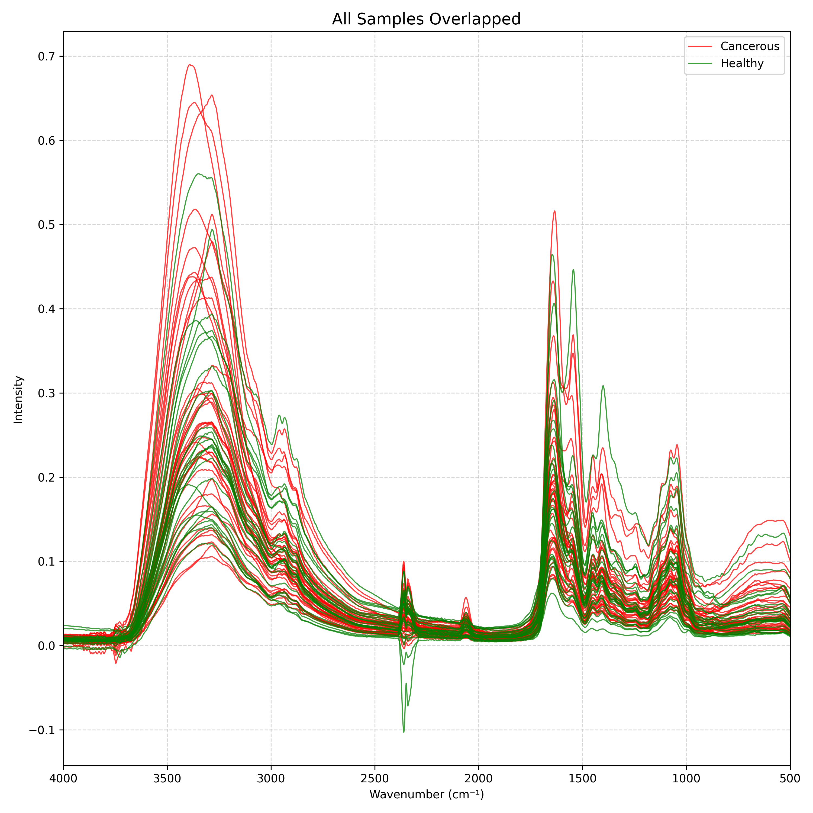
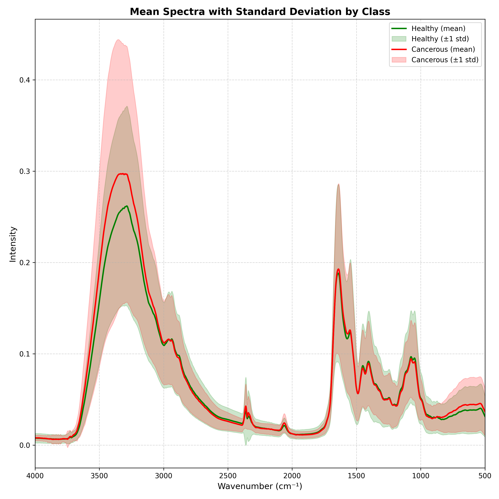
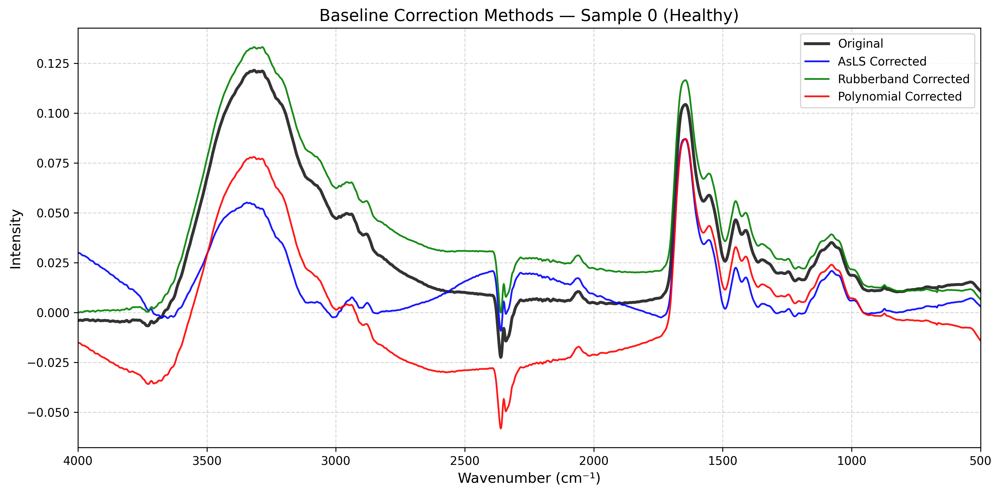
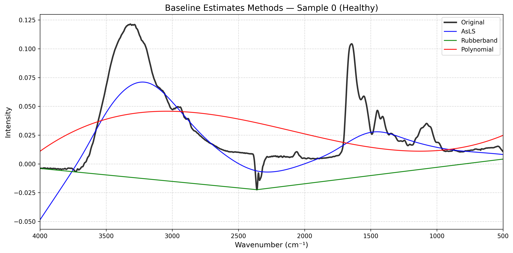
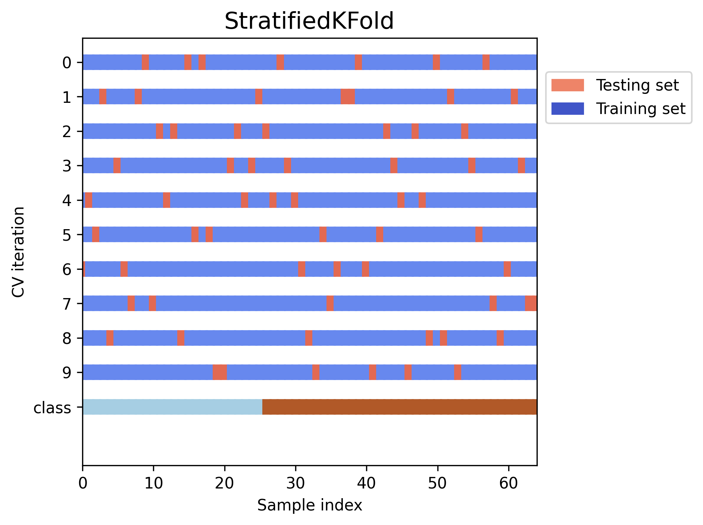

# Attention Mechanism on Oral Cancer Classification


This project aims to validate the hypothesis of a Transformer-based model for oral cancer classification using spectroscopic fingerprint data. Other machine learning algorithms (Support Vector Machines, Convolutional Neural Networks, Long Short-Term Memory and Extreme Gradient Boosting) are being tested and evaluated for comparison purposes.

## Dataset

The dataset is protected by the Federal University of Uberlândia, and therefore cannot be made public for ethical reasons.

<p align="center">
  
  
</p>


- **Input**: Spectroscopic data with wavenumber measurements
- **Output**: Binary classification (-1: non-cancerous, 1: cancerous)
- **Features**: Spectral intensities across different wavenumbers
- **Class distribution**: Cancerous (39 samples) and Non-cancerous (26 samples)

## Preprocessing Pipeline

### 1. **Baseline Correction**: 
Spectroscopy data can suffer several kinds of distorsion, such as radiation scattering, absorption by the supporting substrate, fluctuations in data acquisition conditions, and instrumental instabilities can compromise the accuracy of absorbance values. To mitigate these effects, baseline correction is applied resulting in a purer and more interpretable signal, enabling the precise determination of spectral parameters. 




In this project we are willing to evaluate three different baseline correction algorithims:
1. **Polynomial baseline correction**: A Polynomial function is fitted to the spectrum and subtracted to remove baseline drift.
2. **Rubberband**: A convex hull is constructed over the spectrum, and the baseline is estimated by connecting the lowest points of the convex hull.
3. **Asymmetric least squares (ASLS)**: An iterative method that minimizes a cost function combining fidelity to the data and smoothness of the baseline, with an asymmetry parameter to handle positive peaks.

### 2. **Wavenumber Truncation**: 
Focuses analysis on the biological relevant spectral region (850-3050 cm⁻¹) in order to avoid noises and outliers from less informative regions.

### 3. **Normalization**: 
Standardizes data for model training, there are several normalization techniques available, like Min-Max Scaling, Mean Normalization but the most importat in this project is **Amidae-I** normalization.

Wich, normalizes each spectrum by its highest intensity value within the Amidae-I region (1660-1630 cm⁻¹).

## Training and Evaluation

We applied Stratified k-fold validation with k=10 to ensure robust evaluation of model performance. Dealing with these imbalanced dataset besides the lack of samples.

<p align="center">
    
</p>

### Metrics:
- **Accuracy**: Overall correctness of the model.
- **Precision**: Proportion of positive identifications that were actually correct.
- **Sensitivity (Recall)**: Proportion of actual positives that were correctly identified.
- **Specificity**: Proportion of actual negatives that were correctly identified.
- **F1-Score**: Harmonic mean of precision and recall, providing a balance between the two.

## Models

### Preprocessing Pipeline Comparison

The following tables show the performance of XGBoost and SVM-RBF models across different preprocessing pipelines using 10-fold stratified cross-validation:

### XGBoost Classifier

| Preprocessing Pipeline | Accuracy | Precision | Recall (Sensitivity) | Specificity | F1 Score |
|------------------------|----------|-----------|----------------------|-------------|----------|
| Raw (No Normalization) | 0.6429 ± 0.1483 | 0.7100 ± 0.1234 | 0.7250 ± 0.1750 | 0.5167 ± 0.2522 | 0.7074 ± 0.1185 |
| Rubberband (No SavGol) | 0.6024 ± 0.1300 | 0.6733 ± 0.1517 | 0.7750 ± 0.1750 | 0.3833 ± 0.3078 | 0.6960 ± 0.0951 |
| **AsLS (No SavGol)** | **0.7048 ± 0.1829** | **0.7367 ± 0.1636** | **0.8167 ± 0.1658** | **0.5333 ± 0.2963** | **0.7667 ± 0.1462** |
| Polynomial | 0.5595 ± 0.1252 | 0.6367 ± 0.1394 | 0.6667 ± 0.1581 | 0.3833 ± 0.3167 | 0.6400 ± 0.1118 |

### Support Vector Machine (RBF Kernel)

| Preprocessing Pipeline | Accuracy | Precision | Recall (Sensitivity) | Specificity | F1 Score |
|------------------------|----------|-----------|----------------------|-------------|----------|
| Raw (No Normalization) | 0.6226 ± 0.1140 | 0.6562 ± 0.1100 | 0.8625 ± 0.1850 | 0.2583 ± 0.3139 | 0.7288 ± 0.0920 |
| Rubberband (No SavGol) | 0.6024 ± 0.1002 | 0.6379 ± 0.1198 | 0.8875 ± 0.1672 | 0.1917 ± 0.2900 | 0.7232 ± 0.0789 |
| **AsLS (No SavGol)** | **0.6536 ± 0.1447** | **0.6695 ± 0.1396** | **0.9083 ± 0.1488** | **0.2667 ± 0.3391** | **0.7585 ± 0.1083** |
| Polynomial | 0.5810 ± 0.0994 | 0.6195 ± 0.1077 | 0.8333 ± 0.2007 | 0.1917 ± 0.2947 | 0.6952 ± 0.1014 |

### Tabular Prior-data Fitted Network V2 Classifier

| Preprocessing Pipeline | Accuracy | Precision | Recall (Sensitivity) | Specificity | F1 Score |
|------------------------|----------|-----------|----------------------|-------------|----------|
| Raw (No Normalization) | 0.6159 ± 0.0991 | 0.6383 ± 0.0989 | 0.9083 ± 0.1644 | 0.1722 ± 0.2838 | 0.7360 ± 0.0800 |
| Rubberband (No SavGol) | 0.6032 ± 0.1018 | 0.6281 ± 0.1109 | 0.9167 ± 0.1491 | 0.1444 ± 0.2608 | 0.7309 ± 0.0788 |
| AsLS (No SavGol) | 0.6079 ± 0.1648 | 0.6443 ± 0.1573 | 0.8556 ± 0.1924 | 0.2389 ± 0.3352 | 0.7192 ± 0.1319 |
| Polynomial | 0.5841 ± 0.1059 | 0.6135 ± 0.1033 | 0.8722 ± 0.1822 | 0.1444 ± 0.2643 | 0.7080 ± 0.0988 |

### CatBoost Classifier

| Preprocessing Pipeline | Accuracy | Precision | Recall (Sensitivity) | Specificity | F1 Score |
|------------------------|----------|-----------|----------------------|-------------|----------|
| Raw (No Normalization) | 0.6238 ± 0.2451 | 0.6917 ± 0.2243 | 0.7083 ± 0.2562 | 0.5000 ± 0.3249 | 0.6838 ± 0.2208 |
| Rubberband (No SavGol) | 0.6571 ± 0.2035 | 0.6900 ± 0.1744 | 0.7750 ± 0.2358 | 0.4833 ± 0.2930 | 0.7175 ± 0.1915 |
| **AsLS (No SavGol)** | **0.7238 ± 0.1789** | **0.8100 ± 0.1855** | **0.7667 ± 0.1780** | **0.6667 ± 0.3249** | **0.7702 ± 0.1425** |
| Polynomial | 0.6167 ± 0.2155 | 0.7050 ± 0.2241 | 0.6917 ± 0.1865 | 0.5167 ± 0.3686 | 0.6845 ± 0.1774 |

## Installation

1. Clone the repository
```bash
git clone git@github.com:Lucas-Sabbatini/Attention-Mechanism-on-Oral-Cancer-Classification.git
```

2. Create an Virual Enviroment
```bash
python3 -m venv .venv
```

3. Activate it
```bash
source .venv/bin/activate
```

4. Install dependencies:
```bash
pip install -r requirements.txt
```


## Usage

### Using Preprocessing Components

```python
from preProcess.savitzky_filter import SavitzkyFilter
from preProcess.fingerprint_trucate import WavenumberTruncator
from preProcess.normalization import Normalization

# Apply Savitzky-Golay filter
filtered_data = SavitzkyFilter().buildFilter(X_data)

# Truncate wavenumber range
truncator = WavenumberTruncator()
truncated_data = truncator.trucate_range(3050.0, 850.0, X_data)

# Normalize data
normalizer = Normalization()
normalized_data = normalizer.normalize_data(X_data)
```
