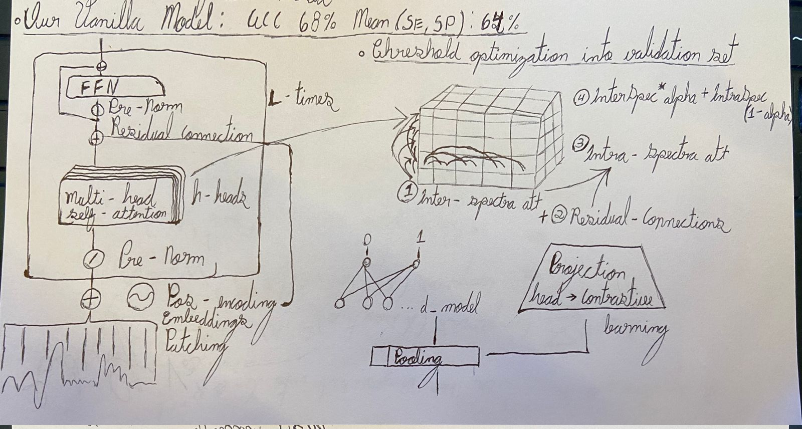
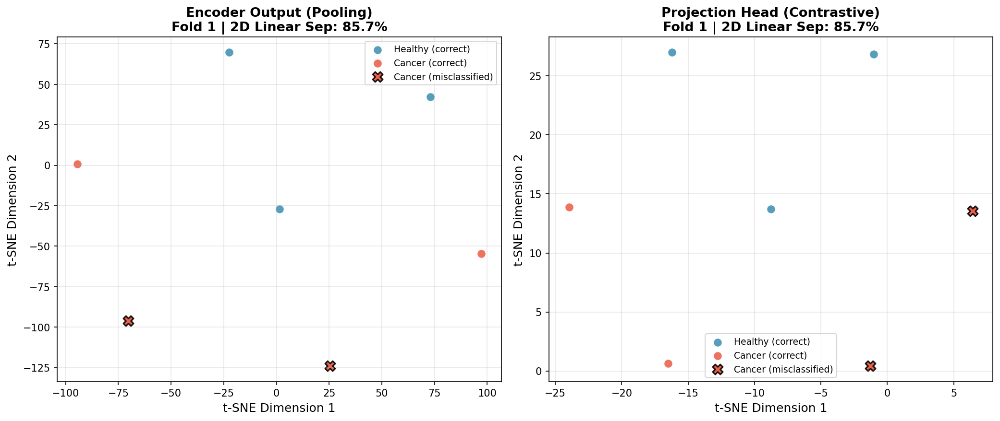
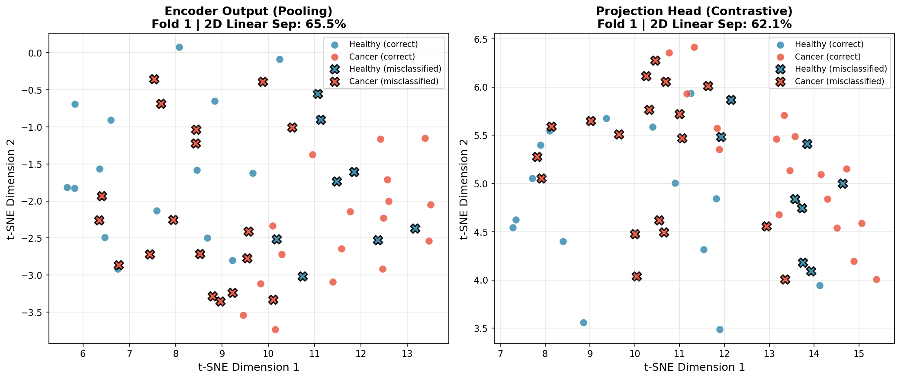
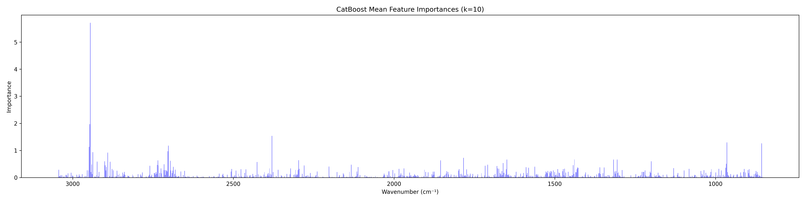

# Attention Mechanism on Oral Cancer Classification


This project aims to validate the hypothesis of a Transformer-based model for oral cancer classification using spectroscopic fingerprint data. Other machine learning algorithms (Support Vector Machines, Convolutional Neural Networks, Long Short-Term Memory and Extreme Gradient Boosting) are being tested and evaluated for comparison purposes.

## Dataset

The dataset is protected by the Federal University of Uberlândia, and therefore cannot be made public for ethical reasons.

<p align="center">
  
  
</p>


- **Input**: Spectroscopic data with wavenumber measurements
- **Output**: Binary classification (-1: non-cancerous, 1: cancerous)
- **Features**: Spectral intensities across different wavenumbers
- **Class distribution**: Cancerous (39 samples) and Non-cancerous (26 samples)

## Preprocessing Pipeline

### 1. **Baseline Correction**: 
Spectroscopy data can suffer several kinds of distorsion, such as radiation scattering, absorption by the supporting substrate, fluctuations in data acquisition conditions, and instrumental instabilities can compromise the accuracy of absorbance values. To mitigate these effects, baseline correction is applied resulting in a purer and more interpretable signal, enabling the precise determination of spectral parameters. 


In this project we are willing to evaluate three different baseline correction algorithims:
1. **Polynomial baseline correction**: A Polynomial function is fitted to the spectrum and subtracted to remove baseline drift.
2. **Rubberband**: A convex hull is constructed over the spectrum, and the baseline is estimated by connecting the lowest points of the convex hull.
3. **Asymmetric least squares (ASLS)**: An iterative method that minimizes a cost function combining fidelity to the data and smoothness of the baseline, with an asymmetry parameter to handle positive peaks.

### 2. **Normalization**: 
Standardizes data for model training, there are several normalization techniques available, like Min-Max Scaling, Mean Normalization but the most importat in this project is **Amidae-I** normalization.

### 3. **Smoothing (Savitzky-Golay Filter)**: 
Reduces noise while preserving important spectral features by fitting successive sub-sets of adjacent data points with a low-degree polynomial using linear least squares. 

The first or second derivative of this filter can be computed to enhance peak resolution, ensuring relevant features while reducing noise.

### 4. **Wavenumber Truncation**: 
Focuses analysis on the biological relevant spectral region (850-3050 cm⁻¹) in order to avoid noises and outliers from less informative regions.

Wich, normalizes each spectrum by its highest intensity value within the Amidae-I region (1660-1630 cm⁻¹).

## Training and Evaluation

We applied Stratified k-fold validation with k=10 to ensure robust evaluation of model performance. Dealing with these imbalanced dataset besides the lack of samples.

<p align="center">
    
</p>

### Metrics:
- **Accuracy**: Overall correctness of the model.
- **Precision**: Proportion of positive identifications that were actually correct.
- **Sensitivity (Recall)**: Proportion of actual positives that were correctly identified.
- **Specificity**: Proportion of actual negatives that were correctly identified.
- **Mean(SE,SP)**: Mean of recall and specificity, providing a balance between the two. Used especially in imbalanced datasets.

## Models

### Preprocessing Pipeline Comparison

The following tables show the performance of several models across different preprocessing pipelines using 10-fold stratified cross-validation:

### XGBoost Classifier

| Preprocessing Pipeline | Accuracy | Precision | Recall (Sensitivity) | Specificity | Mean(SE, SP) |
|------------------------|----------|-----------|----------------------|-------------|-------------|
| Raw (No Normalization) | 0.6381 ± 0.1925 | 0.7283 ± 0.1959 | 0.7250 ± 0.2358 | 0.5167 ± 0.3686 | 0.6208 ± 0.2095 |
| Rubberband (No SavGol) | 0.6024 ± 0.1300 | 0.6733 ± 0.1517 | 0.7750 ± 0.1750 | 0.3833 ± 0.3078 | 0.5792 ± 0.1350 |
| **AsLS (No SavGol)** | **0.7048 ± 0.1829** | **0.7367 ± 0.1636** | **0.8167 ± 0.1658** | **0.5333 ± 0.2963** | **0.6750 ± 0.1970** |
| Polynomial | 0.5167 ± 0.1955 | 0.5671 ± 0.1468 | 0.6417 ± 0.2765 | 0.3167 ± 0.2291 | 0.4792 ± 0.1731 |

### SVM-RBF Classifier

| Preprocessing Pipeline | Accuracy | Precision | Recall (Sensitivity) | Specificity | Mean(SE, SP) |
|------------------------|----------|-----------|----------------------|-------------|-------------|
| Raw (No Normalization) | 0.6024 ± 0.0564 | 0.6024 ± 0.0564 | 1.0000 ± 0.0000 | 0.0000 ± 0.0000 | 0.5000 ± 0.0000 |
| Rubberband (No SavGol) | 0.5738 ± 0.0906 | 0.5971 ± 0.0584 | 0.8750 ± 0.1250 | 0.1000 ± 0.1528 | 0.4875 ± 0.0875 |
| **AsLS (No SavGol)** | **0.6214 ± 0.1623** | **0.6467 ± 0.1256** | **0.8250 ± 0.1601** | **0.3167 ± 0.2291** | **0.5708 ± 0.1625** |
| Polynomial | 0.5714 ± 0.0993 | 0.6021 ± 0.0816 | 0.8417 ± 0.1315 | 0.1500 ± 0.1893 | 0.4958 ± 0.0958 |

### Tabular Prior-data Fitted Network V2 Classifier

| Preprocessing Pipeline | Accuracy | Precision | Recall (Sensitivity) | Specificity | F1 Score |
|------------------------|----------|-----------|----------------------|-------------|----------|
| Raw (No Normalization) | 0.6159 ± 0.0991 | 0.6383 ± 0.0989 | 0.9083 ± 0.1644 | 0.1722 ± 0.2838 | 0.7360 ± 0.0800 |
| Rubberband (No SavGol) | 0.6032 ± 0.1018 | 0.6281 ± 0.1109 | 0.9167 ± 0.1491 | 0.1444 ± 0.2608 | 0.7309 ± 0.0788 |
| AsLS (No SavGol) | 0.6079 ± 0.1648 | 0.6443 ± 0.1573 | 0.8556 ± 0.1924 | 0.2389 ± 0.3352 | 0.7192 ± 0.1319 |
| Polynomial | 0.5841 ± 0.1059 | 0.6135 ± 0.1033 | 0.8722 ± 0.1822 | 0.1444 ± 0.2643 | 0.7080 ± 0.0988 |

### CatBoost Classifier

| Preprocessing Pipeline | Accuracy | Precision | Recall (Sensitivity) | Specificity | F1 Score |
|------------------------|----------|-----------|----------------------|-------------|----------|
| Raw (No Normalization) | 0.6238 ± 0.2451 | 0.6917 ± 0.2243 | 0.7083 ± 0.2562 | 0.5000 ± 0.3249 | 0.6838 ± 0.2208 |
| Rubberband (No SavGol) | 0.6571 ± 0.2035 | 0.6900 ± 0.1744 | 0.7750 ± 0.2358 | 0.4833 ± 0.2930 | 0.7175 ± 0.1915 |
| **AsLS (No SavGol)** | **0.7238 ± 0.1789** | **0.8100 ± 0.1855** | **0.7667 ± 0.1780** | **0.6667 ± 0.3249** | **0.7702 ± 0.1425** |
| Polynomial | 0.6167 ± 0.2155 | 0.7050 ± 0.2241 | 0.6917 ± 0.1865 | 0.5167 ± 0.3686 | 0.6845 ± 0.1774 |

### TabM Classifier

| Preprocessing Pipeline | Accuracy | Precision | Recall (Sensitivity) | Specificity | F1 Score |
|------------------------|----------|-----------|----------------------|-------------|----------|
| Raw (No Normalization) | 0.6024 ± 0.0564 | 0.6024 ± 0.0564 | 1.0000 ± 0.0000 | 0.0000 ± 0.0000 | 0.7503 ± 0.0442 |
| Rubberband (No SavGol) | 0.6190 ± 0.0476 | 0.6190 ± 0.0476 | 0.9667 ± 0.1000 | 0.0667 ± 0.2000 | 0.7503 ± 0.0442 |
| **AsLS (No SavGol)** | **0.6690 ± 0.1585** | **0.6855 ± 0.1480** | **0.9000 ± 0.1225** | **0.3167 ± 0.3532** | **0.7686 ± 0.1075** |
| Polynomial | 0.5810 ± 0.1343 | 0.5948 ± 0.0863 | 0.9167 ± 0.1708 | 0.0667 ± 0.1333 | 0.7182 ± 0.1135 |

### LightGBM Classifier

| Preprocessing Pipeline | Accuracy | Precision | Recall (Sensitivity) | Specificity | Mean(SE, SP) |
|------------------------|----------|-----------|----------------------|-------------|-------------|
| Raw (No Normalization) | 0.5500 ± 0.1658 | 0.6417 ± 0.1745 | 0.6917 ± 0.1493 | 0.3333 ± 0.3249 | 0.5125 ± 0.1826 |
| Rubberband (No SavGol) | 0.5381 ± 0.1569 | 0.6133 ± 0.1439 | 0.6750 ± 0.2512 | 0.3833 ± 0.2693 | 0.5292 ± 0.1593 |
| **AsLS (No SavGol)** | **0.7429 ± 0.1703** | **0.8350 ± 0.1803** | **0.7417 ± 0.1601** | **0.7500 ± 0.2713** | **0.7458 ± 0.1792** |
| Polynomial | 0.4976 ± 0.1855 | 0.5967 ± 0.1963 | 0.5417 ± 0.2116 | 0.4333 ± 0.2906 | 0.4875 ± 0.1928 |

### RealMLP Classifier

| Preprocessing Pipeline | Accuracy | Precision | Recall (Sensitivity) | Specificity | Mean(SE, SP) |
|------------------------|----------|-----------|----------------------|-------------|-------------|
| Raw (No Normalization) | 0.5667 ± 0.1726 | 0.6583 ± 0.2056 | 0.7500 ± 0.2500 | 0.3500 ± 0.3686 | 0.5500 ± 0.1926 |
| Rubberband (No SavGol) | 0.6500 ± 0.2119 | 0.6967 ± 0.1990 | 0.7917 ± 0.1548 | 0.4500 ± 0.3655 | 0.6208 ± 0.2255 |
| **AsLS (No SavGol)** | **0.6810 ± 0.2398** | **0.7317 ± 0.2790** | **0.7500 ± 0.2739** | **0.5833 ± 0.3184** | **0.6667 ± 0.2422** |
| Polynomial | 0.6048 ± 0.1229 | 0.7400 ± 0.1890 | 0.5583 ± 0.2610 | 0.6333 ± 0.3055 | 0.5958 ± 0.1164 |

## Our architecture: SpectralTransformer

A transformer-based architecture designed for spectroscopic data classification:

### 1. Patching and Embedding: 
1D convolution splits the spectrum into overlapping patches (50% overlap) and projects them to the model dimension
### 2. Positional Encoding 
Sinusoidal encoding preserves spectral position information
### 3. Transformer Block
Multi-head self-attention, feed-forward networks, layer normalization, and residual connections (Pre-Norm style)

In this model we applyed two types of attention mechanisms:
1. **Inter-Spectra**: Captures relationships between different spectra (samples) in the dataset, but from the same wavenumber, allowing the model to learn global patterns across samples.
2. **Intra-Spectra**: Captures relationships between different wavenumbers within the same spectrum, allowing the model to learn local patterns within each sample.

Both of them defined as the vanilla attention, but in different dimensions:
$$\text{Attention}(Q, K, V) = \text{softmax}\left(\frac{QK^T}{\sqrt{d_k}}\right)V$$

### 4. Global Average Pooling
Aggregates patch representations into a single vector

### 5. Classification Head and Loss Function

**Classification Head**: Linear layer with dropout that maps the pooled representation to class logits, followed by sigmoid activation for binary classification.

**Projection Head**: 2-layer MLP with BatchNorm and ReLU that projects encoder representations to a lower-dimensional L2-normalized space for contrastive learning.

**Mixed Loss Function**: Combines two objectives:
- **Binary Cross-Entropy (BCE)**: Standard classification loss
- **Supervised Contrastive Loss (SupCon)**: Pulls same-class embeddings together and pushes different-class embeddings apart in the projection space

$$\mathcal{L} = \mathcal{L}_{BCE} + \lambda \cdot \mathcal{L}_{SupCon}$$



### Postprocessing and Evaluation:
With this section our goal is to tell wether the model is able to put samples in a linearly separable space, and to analyze the importance of each wavenumber in the model's decision-making process.




## Postprocessing and Feature Importance
To interpret the model's decisions, we analyzed feature importance using the CatBoost classifier. The bar plot below illustrates how each wavenumber contributed to the model's predictions. Each bar represents the mean importance of a specific wavelenghth across each of the 10 folds in the stratified k-fold validation.



As observed, the highest importance features are concentrated in specific wavenumber regions:
1. **Around 2806.855 cm⁻¹**: This peak is often associated with 𝐶 − 𝐻, −𝐶𝐻3, −𝐶𝐻2  stretching vibrations, which are indicative of lipid content in biological tissues.
2. **Around 910.31 cm⁻¹**: This region contains a myriad of absorption peaks that arise from a complex combination of double-bond stretching vibrations (such as 𝐶 = 𝑂 and 𝐶 = 𝐶) and a variety of single-bond bending vibrations. This overlap of hundreds of vibrational modes from all major biomolecules creates a unique and highly specific pattern that reflects the overall biochemical composition of a cell or tissue.

Attributing high importance to these wavenumbers suggests that the model is effectively leveraging key biochemical signatures relevant to oral cancer classification.
## Installation

1. Clone the repository
```bash
git clone git@github.com:Lucas-Sabbatini/Attention-Mechanism-on-Oral-Cancer-Classification.git
```

2. Create an Virual Enviroment
```bash
python3 -m venv .venv
```

3. Activate it
```bash
source .venv/bin/activate
```

4. Install dependencies:
```bash
pip install -r requirements.txt
```


## Usage

### Using Preprocessing Components

```python
from preProcess.baseline_correction import BaselineCorrection
from preProcess.fingerprint_trucate import WavenumberTruncator
from preProcess.normalization import Normalization

# Apply Savitzky-Golay filter (smoothing)
baseline_corrector = BaselineCorrection()
filtered_data = baseline_corrector.savgol_filter(X_data)

# Apply baseline correction (AsLS method)
baseline = baseline_corrector.asls_baseline(X_data)
corrected_data = X_data - baseline

# Truncate wavenumber range (biologically relevant region)
truncator = WavenumberTruncator()
truncated_data = truncator.trucate_range(X_data, lower_bound=3050.0, upper_bound=850.0)

# Normalize data (Amidae-I peak normalization)
normalizer = Normalization()
normalized_data = normalizer.peak_normalization(X_data, lower_bound=1660.0, upper_bound=1630.0)
```
