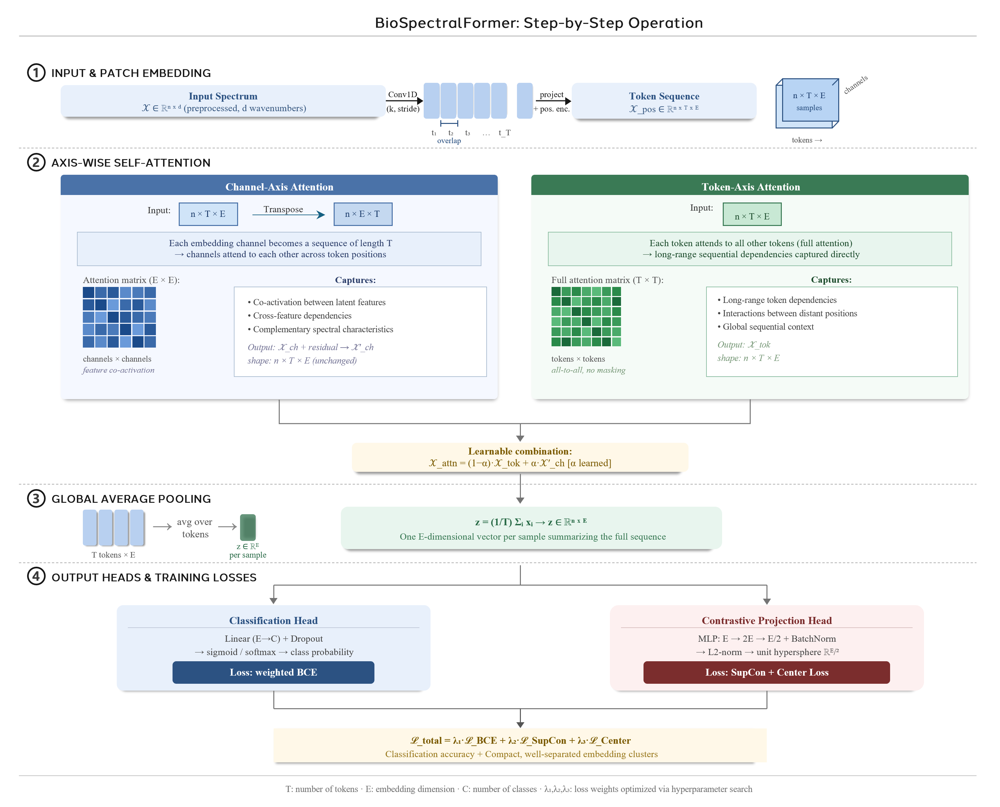
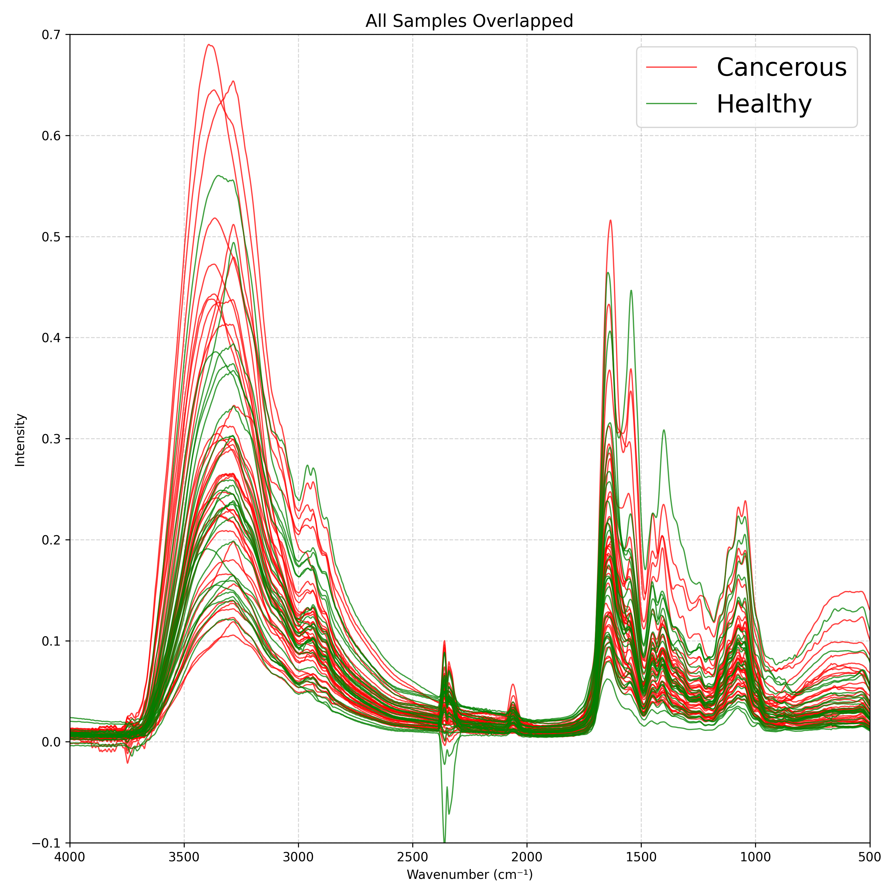
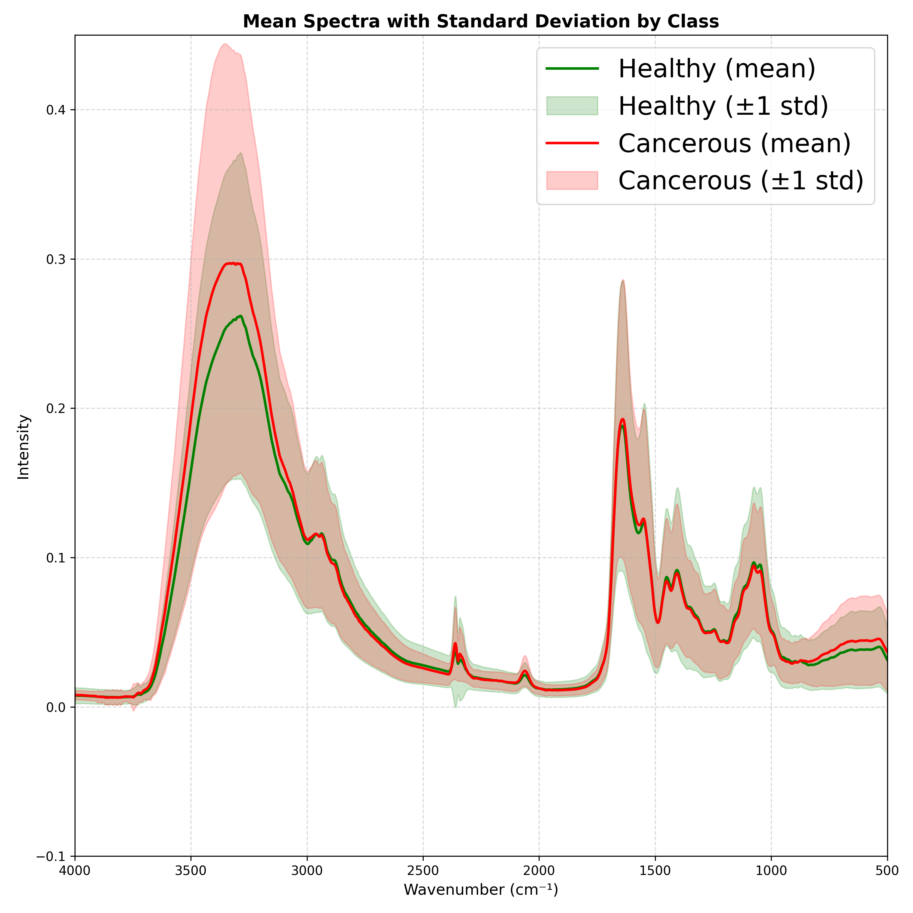
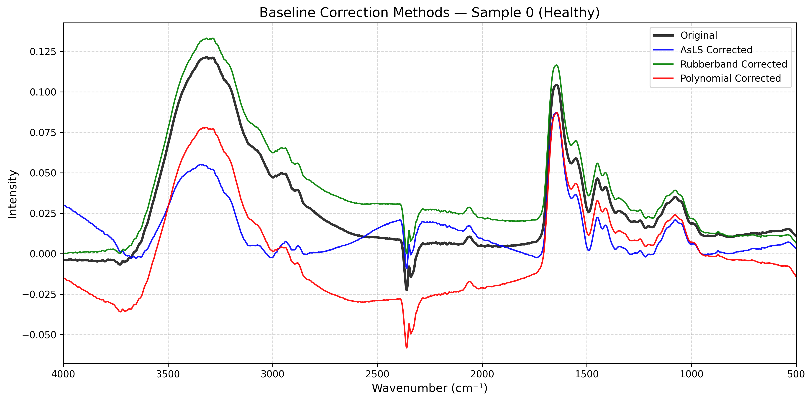
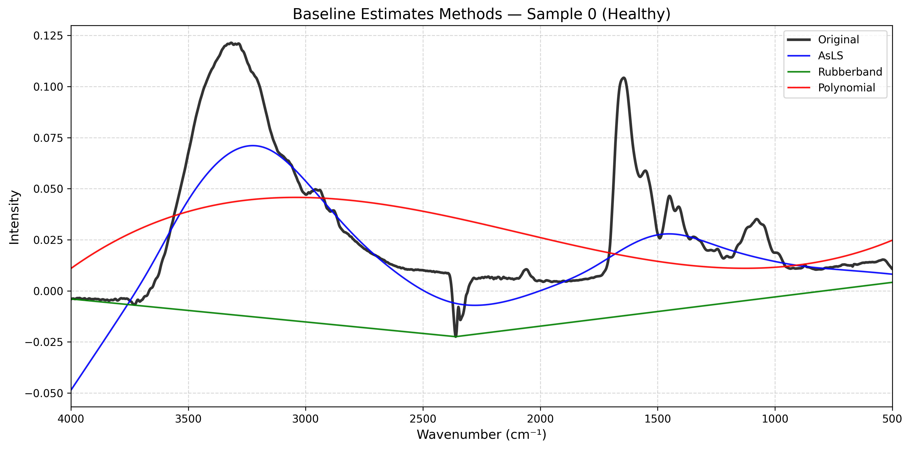
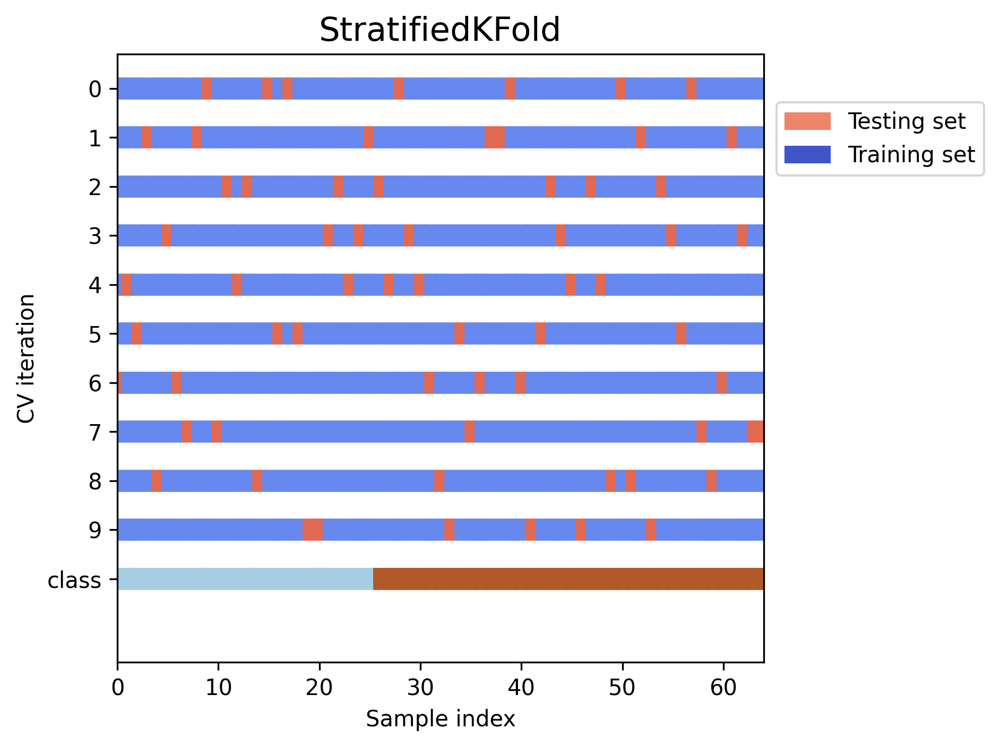
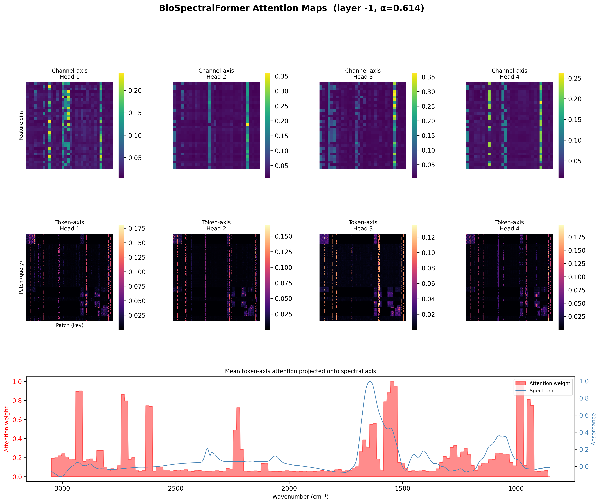

# Attention Mechanism on Oral Cancer Classification



This project implements **BioSpectralFormer (BSF)**, a Transformer-based architecture for classification of salivary FTIR (Fourier-transform infrared) spectra in oral cancer diagnosis. BSF adapts the Transformer paradigm to the biochemical spectral domain through a dual axis-wise attention mechanism (token-axis and channel-axis) and is trained with a multi-objective loss that combines Binary Cross-Entropy, Supervised Contrastive, and Center losses to address the challenges of learning from limited biomedical data.

The model is benchmarked against seven baselines representing different paradigms: **SVM-RBF**, **XGBoost**, **LightGBM**, **CatBoost**, **TabM**, **RealMLP**, and **TabPFN2**. Interpretability is assessed through attention-map analysis, verifying correspondence between the model's attended spectral regions and established oral cancer biomarkers (Amide I/II bands, lipid C-H stretches, nucleic acid backbone).

### Main Results

Average performance (± standard deviation) under stratified 10-fold cross-validation:

| Model | Accuracy | Precision | Recall (SE) | Specificity (SP) | Mean(SE, SP) |
|-------|----------|-----------|-------------|------------------|--------------|
| SVM-RBF | 0.62 ± 0.16 | 0.65 ± 0.13 | **0.83 ± 0.16** | 0.32 ± 0.23 | 0.57 ± 0.16 |
| **LightGBM** | **0.74 ± 0.17** | **0.84 ± 0.18** | 0.74 ± 0.16 | **0.75 ± 0.27** | **0.75 ± 0.18** |
| CatBoost | 0.72 ± 0.18 | 0.81 ± 0.19 | 0.77 ± 0.18 | 0.67 ± 0.32 | 0.72 ± 0.19 |
| XGBoost | 0.70 ± 0.18 | 0.74 ± 0.16 | 0.82 ± 0.17 | 0.53 ± 0.30 | 0.68 ± 0.20 |
| RealMLP | 0.68 ± 0.24 | 0.73 ± 0.28 | 0.75 ± 0.27 | 0.58 ± 0.32 | 0.67 ± 0.24 |
| TabM | 0.60 ± 0.15 | 0.67 ± 0.16 | 0.72 ± 0.18 | 0.42 ± 0.33 | 0.57 ± 0.17 |
| TabPFN2 | 0.52 ± 0.16 | 0.59 ± 0.18 | 0.75 ± 0.22 | 0.18 ± 0.32 | 0.47 ± 0.17 |
| **BSF (ours)** | 0.70 ± 0.15 | 0.72 ± 0.13 | 0.82 ± 0.20 | 0.52 ± 0.25 | 0.67 ± 0.15 |

BSF achieves competitive balanced accuracy with the highest sensitivity among deep learning baselines (0.82 ± 0.20) and the lowest standard deviations among deep models, operating in the same statistical tier as top gradient-boosting methods.

## Installation

1. Clone the repository
```bash
git clone git@github.com:Lucas-Sabbatini/Attention-Mechanism-on-Oral-Cancer-Classification.git
```

2. Create an Virual Enviroment
```bash
python3 -m venv .venv
```

3. Activate it
```bash
source .venv/bin/activate
```

4. Install dependencies:
```bash
pip install -r requirements.txt
```

## Usage

### Using Preprocessing Components

```python
from preProcess.baseline_correction import BaselineCorrection
from preProcess.fingerprint_trucate import WavenumberTruncator
from preProcess.normalization import Normalization

# Apply baseline correction (AsLS method)
baseline = baseline_corrector.asls_baseline(X_data)
corrected_data = X_data - baseline

# Truncate wavenumber range (biologically relevant region)
truncator = WavenumberTruncator()
truncated_data = truncator.trucate_range(X_data, lower_bound=3050.0, upper_bound=850.0)

# Normalize data (Amidae-I peak normalization)
normalizer = Normalization()
normalized_data = normalizer.peak_normalization(X_data, lower_bound=1660.0, upper_bound=1630.0)

# Apply Savitzky-Golay filter (smoothing)
baseline_corrector = BaselineCorrection()
filtered_data = baseline_corrector.savgol_filter(X_data)
```
### Using BioSpectralFormer

```python
from transformer.model import BioSpectralFormer

# Instantiate with Optuna-tuned hyperparameters (paper defaults)
bsf = BioSpectralFormer(
    num_spectral_points=1141,  # wavenumber points after truncation
    d_model=32,                # embedding dimension E
    nhead=4,                   # attention heads
    num_layers=1,              # transformer blocks
    dim_feedforward=64,        # FFN width
    patch_size=16,             # conv kernel (stride = patch_size // 2 for 50% overlap)
    dropout=0.3,
    lr=5e-3,
    weight_decay=5e-5,
    batch_size=8,
    n_epochs=200,
    patience=50,
    bce_weight=0.389,
    supcon_weight=0.081,
    center_loss_weight=0.530,
    supcon_temperature=0.07,
    truncation_range=(3050, 850),
    verbose=True,
)

# Full per-fold workflow: train (with internal train/val split),
# calibrate the classification threshold on the validation set,
# and evaluate on the held-out test fold.
acc, prec, rec, spec, mean_se_sp = bsf.evaluate(
    X_train_fold, X_test_fold, y_train_fold, y_test_fold
)

# Inference with the calibrated threshold
y_pred = bsf.predict(X_test_fold)
probs  = bsf.predict_proba(X_test_fold)
```

## Dataset

The dataset is protected by the Federal University of Uberlândia, and therefore cannot be made public for ethical reasons.

<p align="center">
  
  
</p>


- **Input**: Spectroscopic data with wavenumber measurements
- **Output**: Binary classification (-1: non-cancerous, 1: cancerous)
- **Features**: Spectral intensities across different wavenumbers
- **Class distribution**: Cancerous (39 samples) and Non-cancerous (26 samples)

## Preprocessing Pipeline

### 1. **Baseline Correction**: 
Spectroscopy data can suffer several kinds of distorsion, such as radiation scattering, absorption by the supporting substrate, fluctuations in data acquisition conditions, and instrumental instabilities can compromise the accuracy of absorbance values. To mitigate these effects, baseline correction is applied resulting in a purer and more interpretable signal, enabling the precise determination of spectral parameters. 




In this project we are willing to evaluate three different baseline correction algorithims:
1. **Polynomial baseline correction**: A Polynomial function is fitted to the spectrum and subtracted to remove baseline drift.
2. **Rubberband**: A convex hull is constructed over the spectrum, and the baseline is estimated by connecting the lowest points of the convex hull.
3. **Asymmetric least squares (ASLS)**: An iterative method that minimizes a cost function combining fidelity to the data and smoothness of the baseline, with an asymmetry parameter to handle positive peaks.

### 2. **Normalization**: 
Standardizes data for model training, there are several normalization techniques available, like Min-Max Scaling, Mean Normalization but the most importat in this project is **Amidae-I** normalization.

### 3. **Smoothing (Savitzky-Golay Filter)**: 
Reduces noise while preserving important spectral features by fitting successive sub-sets of adjacent data points with a low-degree polynomial using linear least squares. 

The first or second derivative of this filter can be computed to enhance peak resolution, ensuring relevant features while reducing noise.

### 4. **Wavenumber Truncation**: 
Focuses analysis on the biological relevant spectral region (850-3050 cm⁻¹) in order to avoid noises and outliers from less informative regions.

Wich, normalizes each spectrum by its highest intensity value within the Amidae-I region (1660-1630 cm⁻¹).

## Training and Evaluation

We applied Stratified k-fold validation with k=10 to ensure robust evaluation of model performance. Dealing with these imbalanced dataset besides the lack of samples.

<p align="center">
    
</p>

### Metrics:
- **Accuracy**: Overall correctness of the model.
- **Precision**: Proportion of positive identifications that were actually correct.
- **Sensitivity (Recall)**: Proportion of actual positives that were correctly identified.
- **Specificity**: Proportion of actual negatives that were correctly identified.
- **Mean(SE,SP)**: Mean of recall and specificity, providing a balance between the two. Used especially in imbalanced datasets.

## Models

Seven baselines representing different paradigms were evaluated, all optimized via Optuna:

- **SVM-RBF** — widely established in FTIR literature.
- **XGBoost** — gradient boosting with regularization.
- **LightGBM** — leaf-wise gradient boosting for high-dimensional data.
- **CatBoost** — gradient boosting with ordered boosting.
- **TabM** — parameter-efficient MLP ensemble.
- **RealMLP** — MLP with layer normalization and residual connections.
- **TabPFN2** — Transformer pre-trained for few-example tabular classification.

### Preprocessing Pipeline Comparison

Before the final benchmark, each baseline was evaluated across four preprocessing pipelines (Raw, Rubberband, AsLS, Polynomial) to select the most robust setup. **AsLS (no Savitzky-Golay)** consistently produced the strongest results and was adopted for all downstream experiments. Per-model tables below, under 10-fold stratified cross-validation:

## Our architecture: BioSpectralFormer

A Transformer architecture adapted to the spectral domain for binary classification of salivary FTIR spectra. Preprocessed spectra $\mathcal{X} \in \mathbb{R}^{n \times d}$ ($n{=}65$, $d{=}1141$) are processed through the following stages:

### 1. Patch Embedding
A 1D convolution (kernel $p{=}16$, stride $p/2$) segments each spectrum into $T{=}141$ overlapping patches (50% overlap) projected to embedding dimension $E{=}32$. The output is scaled by $\sqrt{E}$ with dropout applied, yielding $\mathcal{X}^{(c)} \in \mathbb{R}^{n \times T \times E}$.

### 2. Positional Encoding
Sinusoidal positional encodings are added to preserve sequential order along the spectral axis.

### 3. Multi-Head Attention with Dual Axis-Wise Mechanism
Two complementary attention mechanisms operate on the sequence:

1. **Token-Axis Attention** — standard multi-head self-attention across the token dimension, modeling *relational* dependencies between spectral patches (which wavenumber regions co-inform each other).
2. **Channel-Axis Attention** — operates on the embedding dimension (input transposed to $\mathbb{R}^{n \times E \times T}$, projected $T \rightarrow E$, attention applied, projected back), functioning as a *feature-selection gate* that decides which embedding channels are most informative.

Both outputs are fused via a learnable sigmoid-constrained parameter $\alpha \in [0,1]$:

$$\mathcal{X}_{\text{attn}} = (1 - \alpha) \cdot \mathcal{X}_{\text{tok}} + \alpha \cdot \mathcal{X}_{\text{ch}}'$$

Each head computes $\text{Attention}(Q, K, V) = \text{softmax}(QK^T / \sqrt{d_k}) V$ with $h{=}4$ heads and $d_k = E/h$.

### 4. Transformer Block
One Pre-Norm block: layer normalization → dual axis-wise attention → residual + dropout → layer normalization → position-wise FFN (two-layer MLP with ReLU, $d_{ff}{=}64$) → residual + dropout.

### 5. Global Average Pooling
Aggregates token representations into a single vector $z \in \mathbb{R}^{n \times E}$ that feeds both the classification and projection heads.

### 6. Classification and Projection Heads
- **Classification Head**: linear layer with dropout projecting the pooled representation to binary logits (sigmoid activation).
- **Projection Head**: 2-layer MLP with batch normalization ($E \rightarrow 2E \rightarrow E/2$) mapping representations to an L2-normalized embedding space used by the contrastive and center losses.

### 7. Multi-Objective Loss

Training combines three complementary objectives:

$$\mathcal{L}_{\text{total}} = \lambda_{\text{BCE}} \cdot \mathcal{L}_{\text{BCE}} + \lambda_{\text{SupCon}} \cdot \mathcal{L}_{\text{SupCon}} + \lambda_{\text{Center}} \cdot \mathcal{L}_{\text{Center}}$$

- **Binary Cross-Entropy (BCE)** — class-weighted classification loss with $w_{\text{pos}} = N_{\text{neg}} / N_{\text{pos}}$ to counter class imbalance.
- **Supervised Contrastive Loss (SupCon)** — pulls same-class embeddings together and pushes different-class embeddings apart in the projection space ($\tau{=}0.07$); acts as a regularizer against task-specific overfitting.
- **Center Loss** — reduces intra-class variance by compacting embeddings around learnable class centers $\mathbf{c}_{y_i}$, with an inter-center separation term $\mathcal{L}_{\text{sep}}$ pushing distinct class centers apart. Centers are updated by a dedicated SGD optimizer at $10\times$ the main learning rate.

Ablation confirms the three losses are complementary: BCE alone yields 58.8% accuracy / 56.3% Mean(SE,SP); adding SupCon raises accuracy to 68.3% but leaves specificity low (46.7%); adding Center loss produces a more balanced profile (67.9% / 55.0% specificity); the full combination reaches **70.0% accuracy, 66.7% Mean(SE,SP)**.

**Training configuration** (Optuna-optimized): AdamW ($\eta{=}5 \times 10^{-3}$, weight decay $5 \times 10^{-5}$); cosine annealing with warm restarts ($T_0{=}20$, $T_{\text{mult}}{=}2$); gradient clipping (max norm 1.0); early stopping (patience 50) on a score mixing validation accuracy and Silhouette separation; class-balanced sampling ensuring at least 2 samples per class per mini-batch; post-training threshold calibration maximizing Mean(SE, SP). Loss weights: $\lambda_{\text{BCE}}{=}0.389$, $\lambda_{\text{SupCon}}{=}0.081$, $\lambda_{\text{Center}}{=}0.530$.

## Statistical Analysis

### BSF vs. LightGBM (top-performing baseline)

Pairwise comparison across 10 folds (paired t-test and Wilcoxon signed-rank):

| Metric | BSF | LightGBM | Δ | t-stat | p (t-test) | p (Wilcoxon) |
|--------|-----|----------|---|--------|------------|--------------|
| Accuracy | 0.7000 | 0.7429 | −0.0429 | −0.865 | 0.4094 | 0.3750 |
| Precision | 0.7171 | 0.8350 | −0.1179 | −2.115 | 0.0635 | 0.0703 |
| **Sensitivity** | **0.8167** | 0.7417 | +0.0750 | +1.406 | 0.1934 | 0.3750 |
| Specificity | 0.5167 | **0.7500** | −0.2333 | −2.409 | 0.0393 | 0.0625 |
| Mean(SE, SP) | 0.6667 | 0.7458 | −0.0792 | −1.541 | 0.1578 | 0.2109 |

Most metrics show no statistically significant difference ($p > 0.05$). A distinct behavioral pattern emerges: **BSF exhibits higher sensitivity at the cost of specificity**. LightGBM's specificity advantage is only marginally robust (t-test $p{=}0.039$ vs. Wilcoxon $p{=}0.063$).

### Pairwise Post-hoc (Mean(SE, SP))

Rank-difference analysis across all models shows that **SVM-RBF, TabPFN2, and TabM** consistently exhibit significant performance gaps against the top-tier group ($p < 0.05$ or $p < 0.01$ in multiple comparisons). **BioSpectralFormer operates in the highest statistical tier** alongside LightGBM, CatBoost, XGBoost, and RealMLP, with no significant differences among these models — establishing BSF as a viable approach for FTIR-based oral cancer classification.

## Interpretability: Attention Maps

Attention weights from the last Transformer layer are averaged over all heads, samples, and folds, separately for cancer and healthy classes, to identify consistently prioritized spectral regions:

$$\bar{\alpha}_j = \frac{1}{N \cdot h} \sum_{n=1}^{N} \sum_{k=1}^{h} \alpha^{(n,k)}_{j}$$

<p align="center">
  
</p>

### Token-Axis Attention
Per-head analysis reveals meaningful specialization rather than redundancy:

- **Head 2** — emphasizes 1623.9 cm⁻¹ (Amide I shoulder).
- **Head 4** — prioritizes 991.3 cm⁻¹ (nucleic acid backbone, PO₂⁻ modes).
- **Heads 1 and 3** — jointly emphasize lipid C-H stretching (2734.8, 2919.9 cm⁻¹) and Amide II subregions.

Class-separated analysis uncovers a discriminative pattern: **cancer samples** elevate **1546.7 cm⁻¹** as the primary attended hub, while **healthy samples** shift emphasis to **1562.2 cm⁻¹** — a subtle but biologically meaningful displacement within the Amide II band, associated with cancer-driven alterations in protein secondary structure. Regions 991.3, 2919.9, and 2734.8 cm⁻¹ appear prominently in both classes, functioning as shared spectral anchors rather than discriminative features.

### Channel-Axis Attention
Channel dominance is distributed across all embedding dimensions, alternating in ranking across heads and classes without a consistent hierarchy. This diffuse pattern is consistent with the role of channel-axis attention as a **broad feature gate**, complementing the focused relational behavior of token-axis attention. Top attended dimensions were 3 and 27.

### Biological Validation
The attended regions strongly correlate with established oral cancer biomarkers in the literature (Amide I/II bands, lipid C-H stretches, nucleic-acid backbone), suggesting the model is learning biologically relevant features rather than artifacts or noise.

## Limitations and Future Directions

**Limitations.** (i) Reduced sample size — complex models like Transformers are especially susceptible to overfitting on small datasets, and regularization mitigates but does not eliminate this risk. (ii) Absence of external validation — all models were evaluated on the same dataset; independent cohorts are required for true generalization assessment. (iii) Computational cost — $O(T^2 \times E)$ remains efficient for the current configuration but larger datasets may require sparse or linear attention.

**Future directions.** (i) Dataset expansion to 200–500 spectra via multicenter collaborations. (ii) Pre-training on large public FTIR corpora followed by fine-tuning. (iii) Ensemble combining BSF and LightGBM, which have shown complementary strengths and weaknesses.

